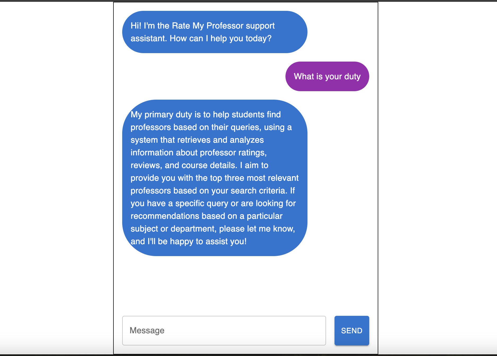

# Ratings RAG - Your support agents for professor ratings. 

## Overview
Ratings RAG is a modern AI web application that helps students find professors based on their queries, using a system that retrieves and analyzes information about professor ratings, reviews, and course details. It aims to provide you with the top three most relevant professors based on your search criteria. 

## Technologies Used
- React: Frontend framework for building the user interface.
- Material-UI: Component library for React to design a beautiful and responsive UI.
- Open-AI: For interacting with AI models to generate flashcards.
- Pinecone: For managed, cloud-native vector database. Long-term memory for high-performance AI applications
- Next.js: Server-side rendering and API routes.

Test it out here!

---

# ratings-rag
